# lk_irrigation 🇱🇰

Realtime Data about *River Water Levels* in Sri Lanka, from the [Irrigation Deptartment](https://www.irrigation.gov.lk)'s [Hydrology and Disaster Management](https://www.irrigation.gov.lk/web/index.php?option=com_content&view=article&id=27&Itemid=128&lang=en) Division.

- [Complete Dataset](data/rwlds) with **6,305 measurements** from **39** stations.
- [Scrape and load logic](src/lk_irrigation/rwld/RiverWaterLevelDataLoadMixin.py)
- [Original Data source](https://www.arcgis.com/apps/dashboards/2cffe83c9ff5497d97375498bdf3ff38)

## River Water Level Map

## Latest measurements

*There were **26** measurements in the last **1 hour**.*

| Measured At | Station (River Basin) | Level (m) | Alert Level | Rate-of-Rise (m/hr) | Rising Alert |
| --- | --- | ---: | --- | ---: | --- |
| 2025-12-01 02:04:56 | Rathnapura (Kalu Ganga) | 6.06 | 🟡 Alert | -0.069 |  |
| 2025-12-01 02:04:38 | Nagalagam Street (Kelani Ganga) | 2.53 | 🔴 Major Flood | 0.000 |  |
| 2025-12-01 02:03:53 | Norwood (Kelani Ganga) | 1.36 | 🟢 Normal | 0.020 | 🔺 Rising |
| 2025-12-01 02:03:47 | Thalgahagoda (Nilwala Ganga) | 1.02 | 🟢 Normal | -0.011 |  |
| 2025-12-01 02:03:35 | Siyambalanduwa (Heda Oya) | 1.25 | 🟢 Normal | -0.010 |  |
| 2025-12-01 02:03:16 | Yaka Wewa (Ma Oya) | 1.29 | 🟢 Normal | -0.020 |  |
| 2025-12-01 02:03:15 | Urawa (Nilwala Ganga) | 0.77 | 🟢 Normal | 0.000 |  |
| 2025-12-01 02:02:20 | Dunamale (Aththanagalu Oya) | 4.80 | 🟠 Minor Flood | -0.050 |  |
| 2025-12-01 02:02:12 | Katharagama (Menik Ganga) | 0.94 | 🟢 Normal | -0.010 |  |
| 2025-12-01 02:02:04 | Pitabeddara (Nilwala Ganga) | 1.12 | 🟢 Normal | -0.010 |  |
| 2025-12-01 02:01:51 | Nakkala (Kumbukkan Oya) | 1.76 | 🟢 Normal | 0.000 |  |
| 2025-12-01 02:01:44 | Thawalama (Gin Ganga) | 2.09 | 🟢 Normal | 0.000 |  |
| 2025-12-01 02:01:41 | Glencourse (Kelani Ganga) | 14.46 | 🟢 Normal | -0.247 |  |
| 2025-12-01 02:01:36 | Kuda Oya (Kirindi Oya) | 1.94 | 🟢 Normal | 0.000 |  |
| 2025-12-01 01:15:18 | Urawa (Nilwala Ganga) | 0.77 | 🟢 Normal | 0.000 |  |
| 2025-12-01 01:09:20 | Hanwella (Kelani Ganga) | 10.10 | 🔴 Major Flood | -0.077 |  |
| 2025-12-01 01:09:10 | Giriulla (Maha Oya) | 3.64 | 🟢 Normal | -0.073 |  |
| 2025-12-01 01:08:39 | Kalawellawa (Millakanda) (Kalu Ganga) | 7.56 | 🟠 Minor Flood | -0.018 |  |
| 2025-12-01 01:08:10 | Glencourse (Kelani Ganga) | 14.68 | 🟢 Normal | -0.247 |  |
| 2025-12-01 01:07:55 | Holombuwa (Kelani Ganga) | 1.47 | 🟢 Normal | -0.039 |  |
| 2025-12-01 01:07:40 | Thanamalwila (Kirindi Oya) | 1.65 | 🟢 Normal | -0.010 |  |
| 2025-12-01 01:06:51 | Baddegama (Gin Ganga) | 2.26 | 🟢 Normal | -0.021 |  |
| 2025-12-01 01:06:39 | Thalgahagoda (Nilwala Ganga) | 1.03 | 🟢 Normal | -0.011 |  |
| 2025-12-01 01:06:23 | Putupaula (Kalu Ganga) | 4.29 | 🟠 Minor Flood | 0.000 |  |
| 2025-12-01 01:06:10 | Urawa (Nilwala Ganga) | 0.77 | 🟢 Normal | 0.000 |  |
| 2025-12-01 01:05:53 | Nagalagam Street (Kelani Ganga) | 2.53 | 🔴 Major Flood | 0.000 |  |

## Latest by Station

*⌛ = Latest measurement is older than **24 hours**.*

| Measured At | Station (River Basin) | Level (m) | Alert Level | Rate-of-Rise (m/hr) | Rising Alert |
| --- | --- | ---: | --- | ---: | --- |
| 2025-11-27 20:03:23⌛ | Peradeniya (Mahaweli Ganga) | 10.56 | 🔴 Major Flood | 0.595 | 🔺 Rising |
| 2025-11-27 13:00:40⌛ | Weraganthota (Mahaweli Ganga) | 8.37 | 🔴 Major Flood | 0.467 | 🔺 Rising |
| 2025-11-28 06:04:09⌛ | Moragaswewa (Deduru Oya) | 8.33 | 🔴 Major Flood | 0.051 | 🔺 Rising |
| 2025-12-01 02:04:38 | Nagalagam Street (Kelani Ganga) | 2.53 | 🔴 Major Flood | 0.000 |  |
| 2025-12-01 00:09:25 | Thanthirimale (Malwathu Oya) | 10.64 | 🔴 Major Flood | -0.033 |  |
| 2025-12-01 01:09:20 | Hanwella (Kelani Ganga) | 10.10 | 🔴 Major Flood | -0.077 |  |
| 2025-11-28 02:13:33⌛ | Manampitiya (Mahaweli Ganga) | 5.95 | 🟠 Minor Flood | 0.095 | 🔺 Rising |
| 2025-11-27 08:02:16⌛ | Thaldena (Mahaweli Ganga) | 4.25 | 🟠 Minor Flood | 0.050 | 🔺 Rising |
| 2025-11-27 18:42:59⌛ | Galgamuwa (Mee Oya) | 6.12 | 🟠 Minor Flood | 0.045 | 🔺 Rising |
| 2025-11-30 14:56:34 | Ellagawa (Kalu Ganga) | 11.94 | 🟠 Minor Flood | 0.044 | 🔺 Rising |
| 2025-12-01 01:06:23 | Putupaula (Kalu Ganga) | 4.29 | 🟠 Minor Flood | 0.000 |  |
| 2025-12-01 01:08:39 | Kalawellawa (Millakanda) (Kalu Ganga) | 7.56 | 🟠 Minor Flood | -0.018 |  |
| 2025-12-01 02:02:20 | Dunamale (Aththanagalu Oya) | 4.80 | 🟠 Minor Flood | -0.050 |  |
| 2025-12-01 01:02:59 | Horowpothana (Yan Oya) | 7.41 | 🟡 Alert | -0.019 |  |
| 2025-12-01 02:04:56 | Rathnapura (Kalu Ganga) | 6.06 | 🟡 Alert | -0.069 |  |
| 2025-12-01 00:24:57 | Badalgama (Maha Oya) | 5.05 | 🟡 Alert | -0.313 |  |
| 2025-12-01 02:03:53 | Norwood (Kelani Ganga) | 1.36 | 🟢 Normal | 0.020 | 🔺 Rising |
| 2025-12-01 01:05:00 | Kithulgala (Kelani Ganga) | 2.35 | 🟢 Normal | 0.000 |  |
| 2025-12-01 01:02:39 | Wellawaya (Kirindi Oya) | 1.23 | 🟢 Normal | 0.000 |  |
| 2025-12-01 02:01:51 | Nakkala (Kumbukkan Oya) | 1.76 | 🟢 Normal | 0.000 |  |
| 2025-12-01 02:01:44 | Thawalama (Gin Ganga) | 2.09 | 🟢 Normal | 0.000 |  |
| 2025-12-01 02:03:15 | Urawa (Nilwala Ganga) | 0.77 | 🟢 Normal | 0.000 |  |
| 2025-12-01 02:01:36 | Kuda Oya (Kirindi Oya) | 1.94 | 🟢 Normal | 0.000 |  |
| 2025-12-01 02:03:35 | Siyambalanduwa (Heda Oya) | 1.25 | 🟢 Normal | -0.010 |  |
| 2025-12-01 01:07:40 | Thanamalwila (Kirindi Oya) | 1.65 | 🟢 Normal | -0.010 |  |
| 2025-12-01 01:03:40 | Panadugama (Nilwala Ganga) | 3.54 | 🟢 Normal | -0.010 |  |
| 2025-12-01 02:02:04 | Pitabeddara (Nilwala Ganga) | 1.12 | 🟢 Normal | -0.010 |  |
| 2025-12-01 02:02:12 | Katharagama (Menik Ganga) | 0.94 | 🟢 Normal | -0.010 |  |
| 2025-12-01 02:03:47 | Thalgahagoda (Nilwala Ganga) | 1.02 | 🟢 Normal | -0.011 |  |
| 2025-12-01 00:01:55 | Nawalapitiya (Mahaweli Ganga) | 1.99 | 🟢 Normal | -0.011 |  |
| 2025-12-01 02:03:16 | Yaka Wewa (Ma Oya) | 1.29 | 🟢 Normal | -0.020 |  |
| 2025-12-01 01:06:51 | Baddegama (Gin Ganga) | 2.26 | 🟢 Normal | -0.021 |  |
| 2025-11-30 14:03:57 | Padiyathalawa (Maduru Oya) | 1.17 | 🟢 Normal | -0.021 |  |
| 2025-12-01 01:04:54 | Deraniyagala (Kelani Ganga) | 1.45 | 🟢 Normal | -0.030 |  |
| 2025-12-01 00:00:09 | Moraketiya (Walawe Ganga) | 1.41 | 🟢 Normal | -0.030 |  |
| 2025-12-01 01:07:55 | Holombuwa (Kelani Ganga) | 1.47 | 🟢 Normal | -0.039 |  |
| 2025-12-01 01:09:10 | Giriulla (Maha Oya) | 3.64 | 🟢 Normal | -0.073 |  |
| 2025-11-30 23:01:04 | Magura (Kalu Ganga) | 2.47 | 🟢 Normal | -0.090 |  |
| 2025-12-01 02:01:41 | Glencourse (Kelani Ganga) | 14.46 | 🟢 Normal | -0.247 |  |

## River Water Level Charts by Station

### Peradeniya (Mahaweli Ganga)

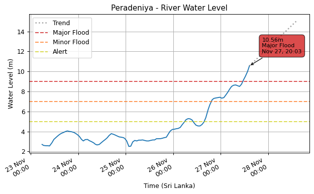

### Weraganthota (Mahaweli Ganga)

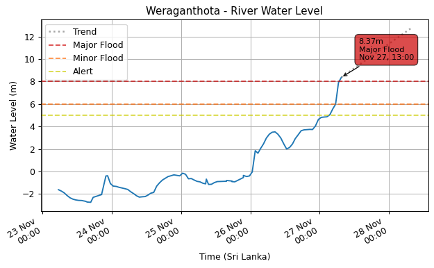

### Moragaswewa (Deduru Oya)

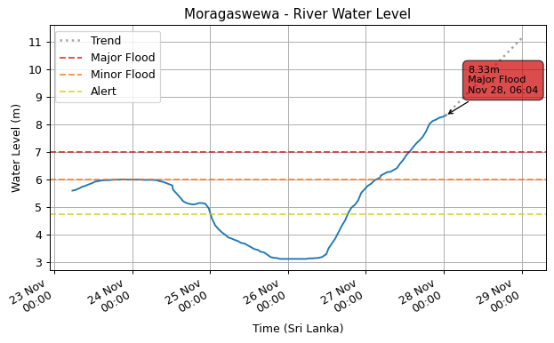

### Nagalagam Street (Kelani Ganga)

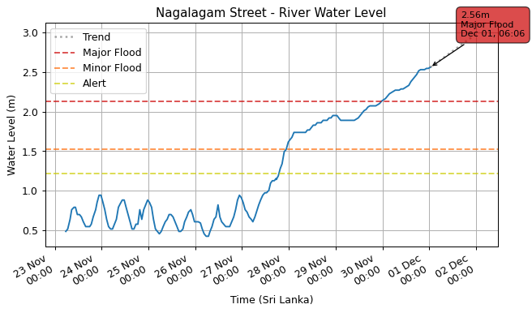

### Thanthirimale (Malwathu Oya)

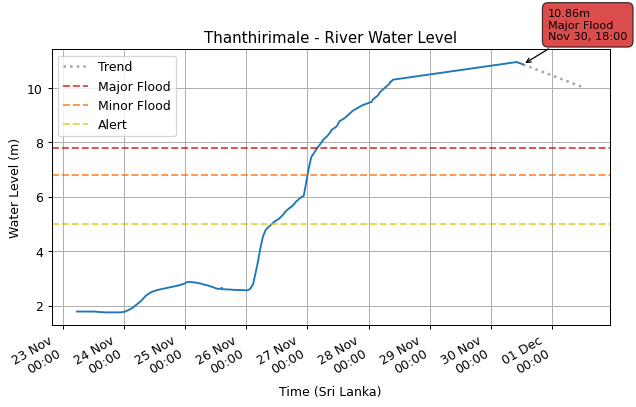

### Hanwella (Kelani Ganga)

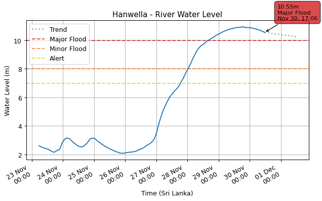

### Manampitiya (Mahaweli Ganga)

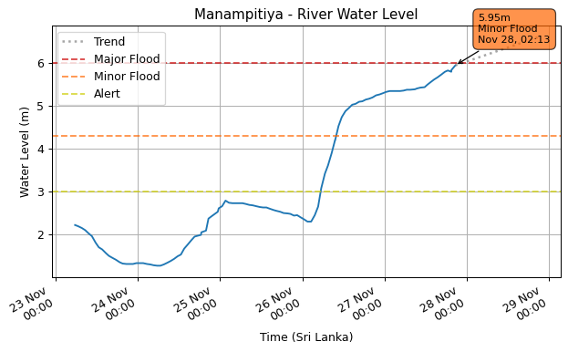

### Thaldena (Mahaweli Ganga)

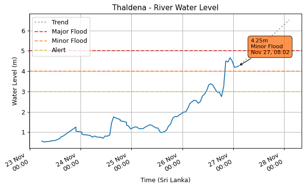

### Galgamuwa (Mee Oya)

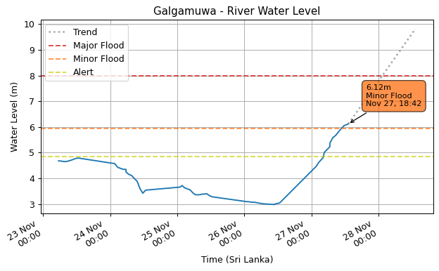

### Ellagawa (Kalu Ganga)

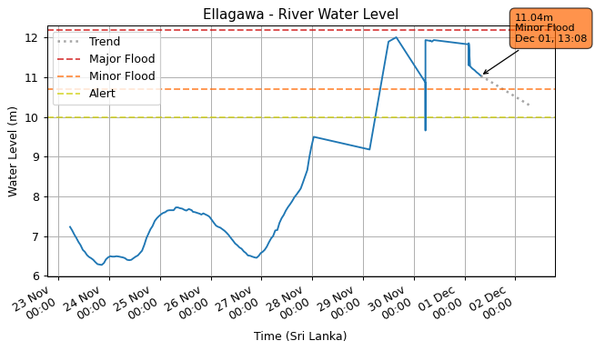

### Putupaula (Kalu Ganga)

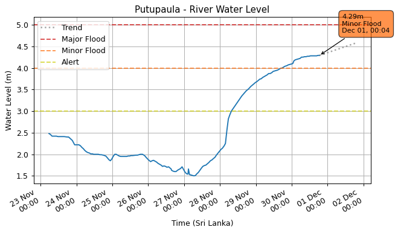

### Kalawellawa (Millakanda) (Kalu Ganga)

.png)

### Dunamale (Aththanagalu Oya)

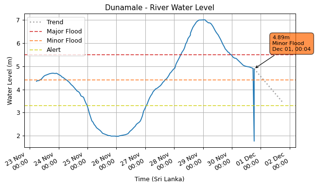

### Horowpothana (Yan Oya)

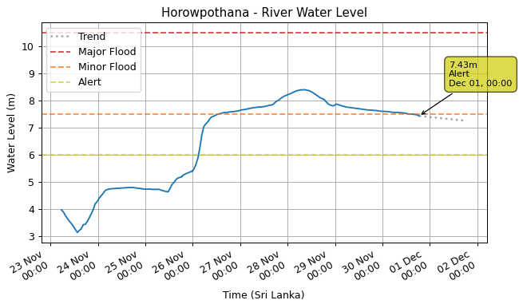

### Rathnapura (Kalu Ganga)

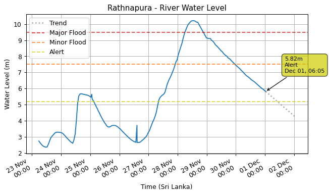

### Badalgama (Maha Oya)

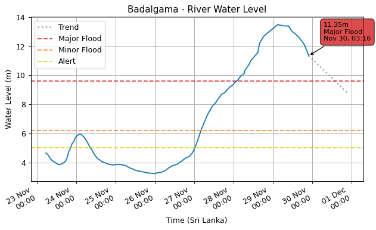

### Norwood (Kelani Ganga)

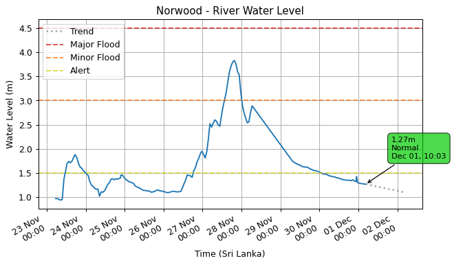

### Kithulgala (Kelani Ganga)

### Wellawaya (Kirindi Oya)

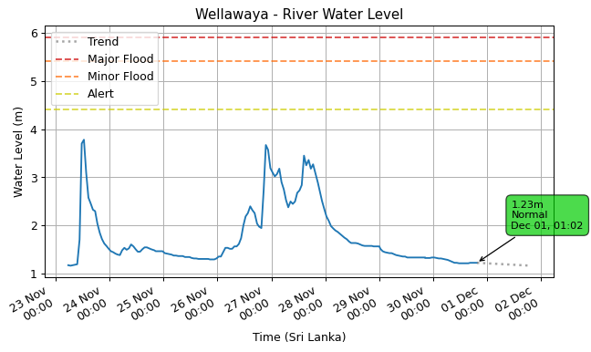

### Nakkala (Kumbukkan Oya)

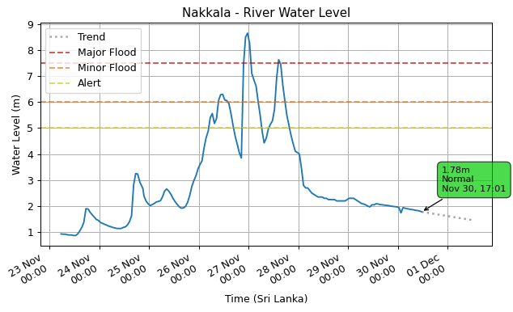

### Thawalama (Gin Ganga)

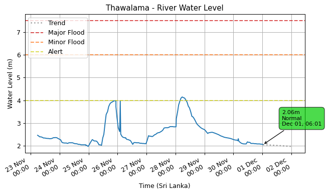

### Urawa (Nilwala Ganga)

### Kuda Oya (Kirindi Oya)

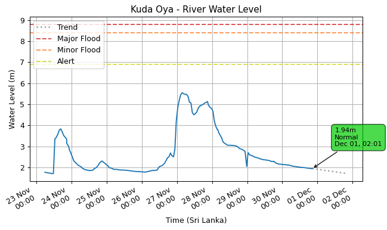

### Siyambalanduwa (Heda Oya)

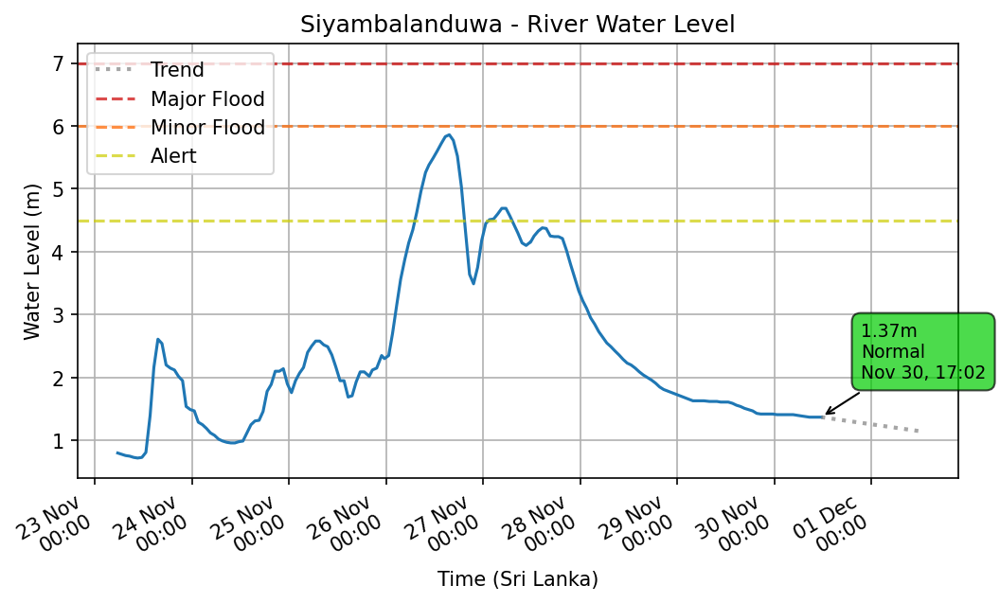

### Thanamalwila (Kirindi Oya)

### Panadugama (Nilwala Ganga)

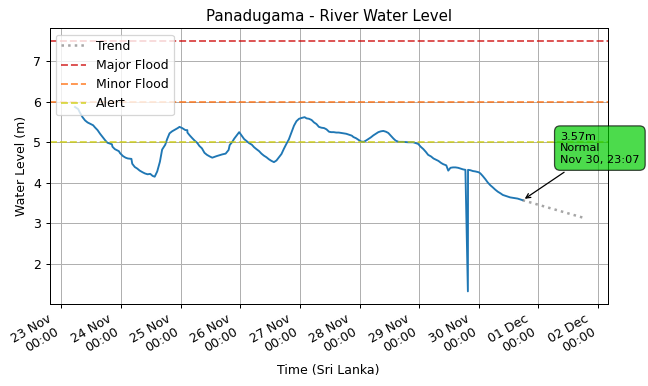

### Pitabeddara (Nilwala Ganga)

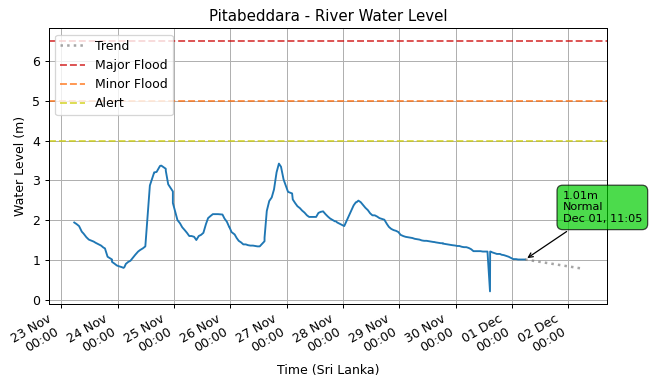

### Katharagama (Menik Ganga)

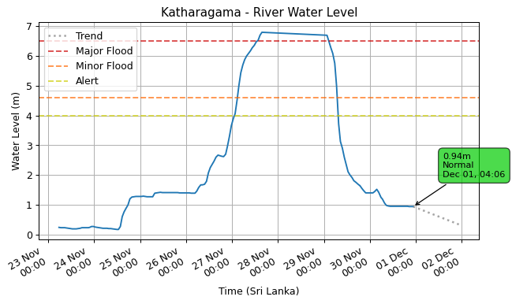

### Thalgahagoda (Nilwala Ganga)

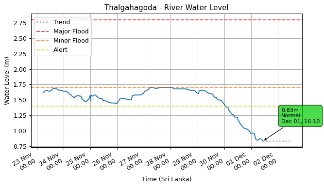

### Nawalapitiya (Mahaweli Ganga)

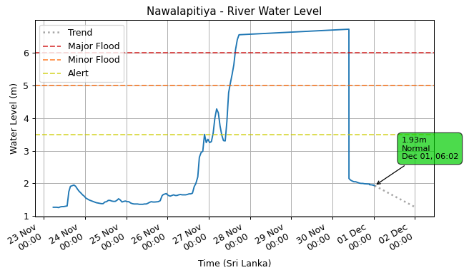

### Yaka Wewa (Ma Oya)

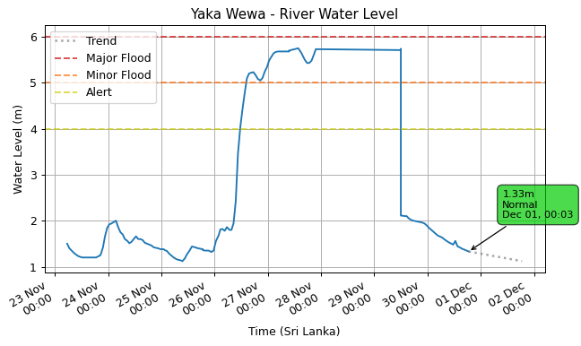

### Baddegama (Gin Ganga)

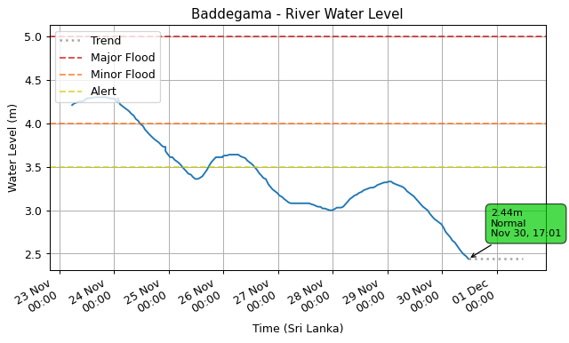

### Padiyathalawa (Maduru Oya)

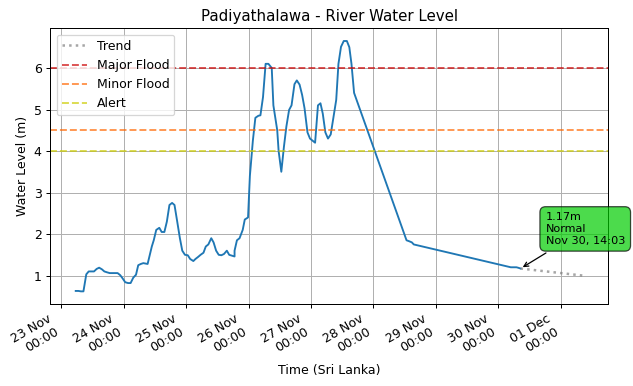

### Deraniyagala (Kelani Ganga)

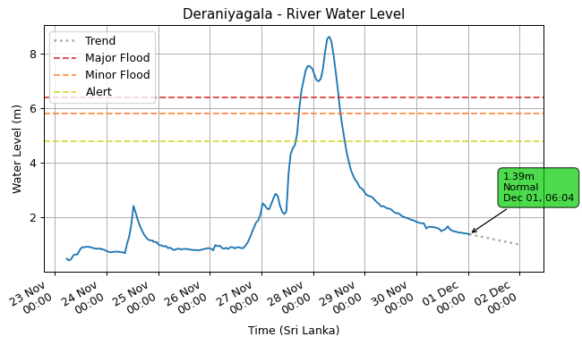

### Moraketiya (Walawe Ganga)

### Holombuwa (Kelani Ganga)

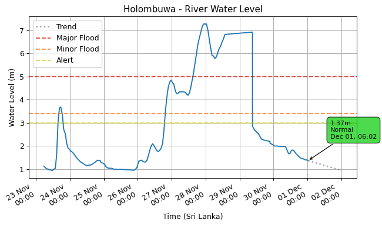

### Giriulla (Maha Oya)

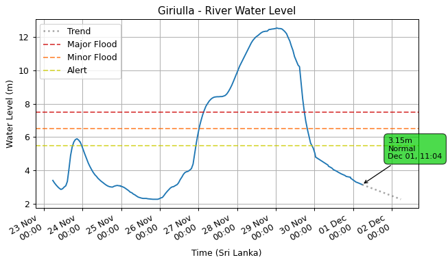

### Magura (Kalu Ganga)

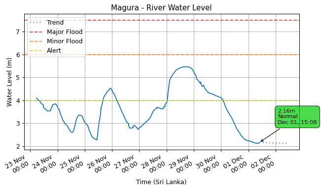

### Glencourse (Kelani Ganga)

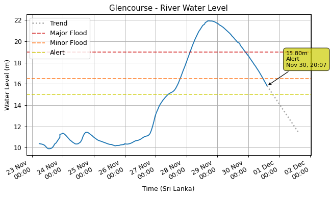

